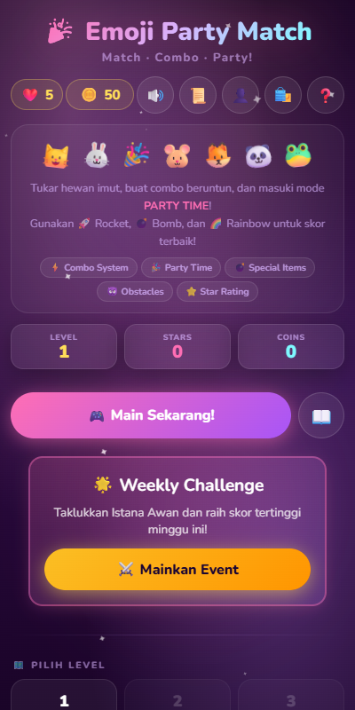

  
# 🌸 Emoji Party Match HTML5 🌸

**A Beautiful, Standalone Vanilla JavaScript Match-3 Game**

 

### 🕹️ [PLAY THE GAME NOW](https://firmanwazir.github.io/html5-emoji-match/)

 

[*[Read in Indonesian / Baca dalam Bahasa Indonesia]👇*](#indonesian-bahasa-indonesia)

  

**Emoji Party Match HTML5** is a casual match-3 puzzle game featuring a beautiful feminine theme (Sakura, ribbons, cosmetics). Built entirely using pure web technologies (**Vanilla JS, HTML5 Canvas, and CSS3**). This game is designed to be **100% Standalone**, meaning you don't need a local server (like Node.js/Apache) to run it. Simply open the index file in your browser, and you are ready to play!

## ✨ Key Features

- **🎀 Elegant Feminine Theme:** Modern glassmorphism UI design with pastel color palettes and buttery smooth micro-animations (60fps).
- **🐱 Interactive Mascot (Mochi):** An animated cat mascot that reacts (*happy, sad, excited*) to your moves and combos during gameplay.
- **🚀 Boosters & Special Items:**
  - *Rocket* (Match 4) - Clears an entire row or column.
  - *Bomb* (L/T Shape) - Explodes emojis in a 3x3 surrounding area.
  - *Rainbow* (Match 5) - Clears all emojis of the same color on the board.
- **🗺️ Story Mode:** Dozens of unique levels with story dialogues and varying difficulties/obstacles (Sleeping Emojis, Angry Emojis, etc.).
- **🏅 Complete Progression System:**
  - Player Profiles & Avatar customization.
  - Achievement System (Badges).
  - Daily Rewards.
  - Daily Quests (Challenges with coin rewards).
- **⚡ Standalone & Bundled:** All scripts use ES6 modules bundled via esbuild, ensuring it runs flawlessly offline via the local file protocol (`file://`) without CORS security blocks.

---

## 🎮 How to Play

1. **Swap Emojis:** Tap an emoji, then tap an adjacent one, or simply swipe to swap their positions.
2. **Form a Line:** Match at least 3 identical emojis horizontally or vertically.
3. **Complete Objectives:** Check the top panel to see the level's mission (e.g., Collect 20 Sakura Flowers). You beat the level by reaching the target before running out of moves!
4. **Party Time:** Fill the Party meter on the left by scoring points to enter "Party Time", triggering Confetti and massive bonus scores!

---

## 🚀 How to Run the Game

This game requires absolutely zero build tools or servers to play.

1. Download or Clone this repository to your computer.
2. Open the project folder.
3. **Double-click the `index.html` file** using your favorite modern browser (Chrome, Edge, Safari, Firefox).
4. Enjoy the game!

---

## 🛠️ Tech Stack

- **HTML5:** Core structure and Canvas element (used for the Confetti particle system and image exporter).
- **CSS3:** Vanilla CSS for modern UI (Glassmorphism, filters, Flexbox/Grid) and Keyframe Animations.
- **Vanilla JavaScript:** Match-3 grid logic, pattern detection algorithms (Match-4, L-Shape), local Save Data via `localStorage`, and Audio system.
- **ESBuild:** Used internally to bundle `.js` files, making the game playable offline without HTTP protocols.

   

---
---

 

  <h2 id="indonesian-bahasa-indonesia">🇮🇩 Indonesian (Bahasa Indonesia)</h2>

  

**Emoji Party Match HTML5** adalah game *Match-3* bergaya kasual dengan tema feminin (Sakura, pita, kosmetik) yang dibangun sepenuhnya menggunakan teknologi web murni (**Vanilla JS, HTML5 Canvas, dan CSS3**). Game ini dirancang **100% Standalone**, artinya kamu tidak memerlukan server lokal (Node.js/Apache) untuk menjalankannya. Cukup buka file indeks di *browser*, dan game siap dimainkan!

## ✨ Fitur Utama

- **🎀 Tema Feminin & Elegan:** Desain antarmuka bergaya *glassmorphism* modern dengan palet warna pastel dan animasi mikro yang sangat mulus (60fps).
- **🐱 Maskot Interaktif (Mochi):** Maskot kucing animasi yang akan bereaksi (*senang, sedih, bersemangat*) terhadap gerakan dan *combo* kamu saat bermain.
- **🚀 Booster & Spesial Item:**
  - *Rocket* (Match 4) - Menghancurkan 1 baris/kolom penuh.
  - *Bomb* (L/T Shape) - Meledakkan area 3x3 di sekitarnya.
  - *Rainbow* (Match 5) - Menghapus semua emoji dengan warna yang sama.
- **🗺️ Story Mode:** Tersedia puluhan level unik dengan dialog cerita dan berbagai tingkat kesulitan/rintangan (Sleeping Emoji, Angry Emoji, dll).
- **🏅 Sistem Progresi Lengkap:**
  - Profil pemain & kustomisasi Avatar.
  - Sistem *Achievement* (Lencana).
  - *Daily Rewards* (Hadiah Harian).
  - Misi / Quest (Tantangan harian dengan hadiah koin).
- **⚡ Standalone & Bundled:** Seluruh skrip menggunakan modul ES6 yang telah di-*bundle* menggunakan esbuild, sehingga aman dari pemblokiran keamanan CORS browser jika dibuka via file lokal (`file://`).

---

## 🎮 Cara Bermain

1. **Tukar (Swap) Emoji:** Ketuk satu emoji, lalu ketuk emoji di sebelahnya, atau langsung geser (*swipe*) untuk menukar posisi mereka.
2. **Bentuk Barisan:** Cocokkan minimal 3 emoji yang sama dalam posisi vertikal maupun horizontal.
3. **Kumpulkan Objektif:** Perhatikan panel bagian atas layar untuk melihat misi level (Misal: Kumpulkan 20 Bunga Sakura). Level selesai ketika kamu memenuhi target objektif sebelum jumlah langkah (*moves*) kamu habis!
4. **Party Time:** Penuhi meteran *Party* di sebelah kiri dengan mencetak poin untuk masuk ke mode "Party Time" yang memicu *Confetti* dan bonus skor besar-besaran!

---

## 🚀 Cara Menjalankan Game

Game ini sama sekali tidak memerlukan *build tools* atau server saat dimainkan. 

1. Unduh / Clone repositori ini ke dalam komputermu.
2. Buka folder proyek.
3. **Klik ganda (*Double-click*) file `index.html`** menggunakan *browser* modern favoritmu (Chrome, Edge, Safari, Firefox).
4. Selamat bermain!

---

## 🛠️ Teknologi yang Digunakan

- **HTML5:** Struktur utama dan elemen Canvas (untuk sistem partikel *Confetti* & pengekspor gambar).
- **CSS3:** Menggunakan Vanilla CSS untuk UI modern (*Glassmorphism*, filter, Flexbox/Grid) dan Animasi Keyframes.
- **Vanilla JavaScript:** Logika *Grid Match-3*, algoritma deteksi pola (Match-4, L-Shape), *Save Data* menggunakan `localStorage`, dan sistem *Audio*.
- **ESBuild:** Digunakan secara internal untuk menyatukan (*bundling*) file `.js` agar bisa dijalankan luring (offline) tanpa protokol HTTP.
